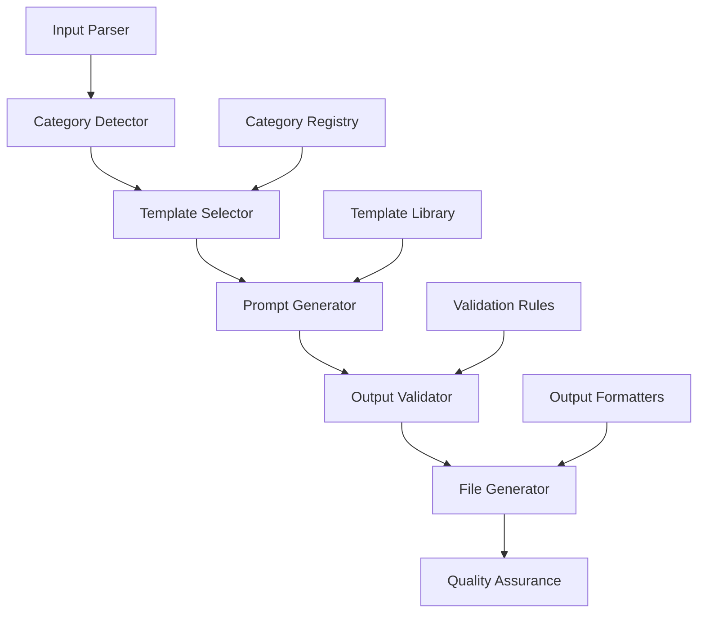
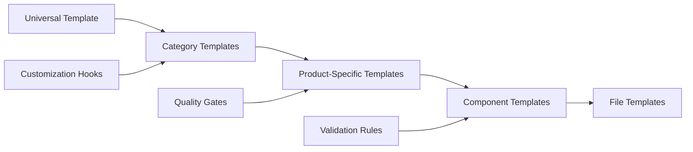

# Universal Prompt Generator for Qoder IDE - Design Document

## Overview

The Universal Prompt Generator is an intelligent prompt factory system integrated into Qoder IDE that automatically generates specialized, production-ready prompt suites for creating any digital product, application, or artifact. This system transforms high-level product specifications into complete, executable development workflows.

### Core Value Proposition
- **Self-Contained**: Each generated prompt suite includes everything needed for production
- **Category-Specific**: Optimized templates for 10+ product categories
- **Production-Ready**: Complete source code, tests, documentation, and deployment configs
- **Workflow-Integrated**: Seamless integration with Qoder IDE development environment

## Technology Stack & Dependencies

### Core Framework
- **Template Engine**: Dynamic prompt generation with variable substitution
- **Category System**: Modular architecture supporting extensible product types
- **Validation Engine**: Quality assurance and output verification
- **Integration Layer**: Qoder IDE workspace and project management integration

### Input Processing
- **Variable Parsing**: Dynamic input parameter extraction and validation
- **Context Analysis**: Project type detection and requirement inference
- **Constraint Handling**: Technical limitations and requirement processing

### Output Generation
- **Multi-File Generation**: Coordinated creation of related file sets
- **Template Rendering**: Dynamic content generation with placeholders
- **Quality Validation**: Automated testing and verification of generated artifacts

## System Architecture

### Core Components



### Category System Architecture

| Category | Subcategories | Primary Outputs | Validation Type |
|----------|---------------|-----------------|-----------------|
| Applications | web-app, mobile-app, desktop-app, cli-tool | Source code, UI components, build configs | Functional testing |
| Websites | landing-page, e-commerce, portfolio-site | HTML/CSS/JS, CMS integration, SEO optimization | Performance validation |
| APIs | rest-api, graphql-api, websocket-service | Endpoint definitions, schemas, middleware | API testing |
| Games | web-game, mobile-game, interactive-story | Game engine setup, physics systems, assets | Performance profiling |
| AI/ML | chatbot, ml-model, computer-vision | Training pipelines, inference services, datasets | Model validation |

### Template Structure Hierarchy



## Feature Specifications

### Input Processing System

#### Core Input Parameters
```
CATEGORY: Product type identifier (required)
PROJECT_NAME: Target project identifier (required)
TECH_STACK: Technology and framework specifications
TARGET_AUDIENCE: End user demographics and requirements
DEPLOYMENT_TARGET: Platform and hosting specifications
CONSTRAINTS: Technical limitations and compliance requirements
```

#### Advanced Customization
```
STYLE_PREFERENCES: UI/UX design guidelines
FEATURE_FLAGS: Optional functionality toggles
INTEGRATION_APIS: Third-party service specifications
PERFORMANCE_TARGETS: Benchmark requirements
COMPLIANCE_REQUIREMENTS: Security and regulatory standards
```

### Prompt Generation Engine

#### Template Processing Pipeline
1. **Category Analysis**: Product type identification and requirement mapping
2. **Architecture Planning**: Technology stack optimization and pattern selection
3. **Feature Specification**: Core and optional functionality definition
4. **Code Generation**: Complete implementation with best practices
5. **Quality Validation**: Automated testing and performance verification
6. **Documentation Creation**: User guides, API documentation, deployment instructions

#### Output File Organization
```
/src/           # Application source code
/public/        # Static assets and resources
/docs/          # Documentation and guides
/config/        # Environment and build configuration
/tests/         # Testing suites and validation
/scripts/       # Automation and deployment scripts
```

### Category-Specific Generators

#### Application Development (web-app, mobile-app, desktop-app)
- **Architecture**: Modern component-based design patterns
- **State Management**: Redux, Zustand, or framework-specific solutions
- **Testing Strategy**: Unit, integration, and E2E testing suites
- **Build Configuration**: Webpack, Vite, or platform-specific build tools
- **Deployment**: CI/CD pipelines and hosting configurations

#### Website Development (landing-page, e-commerce, portfolio-site)
- **Responsive Design**: Mobile-first CSS and cross-browser compatibility
- **SEO Optimization**: Meta tags, structured data, and performance metrics
- **Content Management**: Dynamic content systems and admin interfaces
- **Analytics Integration**: User tracking and conversion optimization
- **Performance**: Image optimization and caching strategies

#### API Development (rest-api, graphql-api, websocket-service)
- **Schema Definition**: OpenAPI specifications and type definitions
- **Authentication**: JWT, OAuth, and authorization middleware
- **Database Integration**: ORM models and migration scripts
- **Documentation**: Interactive API documentation and testing tools
- **Monitoring**: Rate limiting, logging, and performance tracking

### Quality Assurance Framework

#### Functional Testing
- **Unit Tests**: Component and function-level validation
- **Integration Tests**: API endpoint and service interaction testing
- **E2E Scenarios**: Complete user workflow validation
- **Accessibility Testing**: WCAG compliance and screen reader compatibility

#### Performance Validation
- **Load Testing**: Concurrent user simulation and stress testing
- **Memory Profiling**: Resource usage optimization and leak detection
- **Optimization**: Code splitting, caching, and performance tuning
- **Monitoring**: Real-time performance metrics and alerting

#### Security Review
- **Vulnerability Scanning**: Automated security assessment
- **Penetration Testing**: Manual security validation
- **Compliance Checking**: GDPR, HIPAA, and industry standard validation
- **Code Review**: Security best practices and threat modeling

## Workflow Integration

### Git Integration
```
Branch Naming: category/project-name-YYYYMMDD
Commit Format: feat(category): initialize project-name
Tag Strategy: v1.0.0-category-release
```

### Development Workflow
1. **Project Initialization**: Automated repository setup and configuration
2. **Development Environment**: Docker containers and local development stacks
3. **Testing Pipeline**: Automated test execution and coverage reporting
4. **Code Quality**: Linting, formatting, and documentation standards
5. **Deployment Automation**: Build scripts and hosting configuration

### Qoder IDE Integration
- **Workspace Management**: Project creation and file organization
- **Template Selection**: Interactive category and feature selection
- **Live Preview**: Real-time output generation and validation
- **Project Monitoring**: Build status and deployment tracking

## Validation & Testing Strategy

### Template Validation
- **Syntax Checking**: Template syntax and variable validation
- **Output Verification**: Generated file structure and content validation
- **Integration Testing**: Multi-template workflow validation
- **Performance Testing**: Generation speed and resource usage optimization

### Generated Output Testing
- **Functional Validation**: Feature completeness and correctness
- **Code Quality**: Linting, formatting, and best practice compliance
- **Security Assessment**: Vulnerability scanning and compliance checking
- **Performance Benchmarking**: Load testing and optimization validation

### User Acceptance Testing
- **Usability Testing**: Developer experience and workflow efficiency
- **Documentation Review**: Clarity and completeness of generated guides
- **Integration Validation**: Compatibility with existing development workflows
- **Feedback Integration**: User experience improvements and feature requests

## Success Metrics

### Generation Quality
- **Functional Completeness**: 100% of specified features working correctly
- **Performance Targets**: Sub-second generation for standard templates
- **Code Quality**: 90%+ test coverage for generated applications
- **Documentation Coverage**: Complete setup and usage documentation

### Developer Experience
- **Setup Time**: <5 minutes from template to running application
- **Customization Flexibility**: 95% of common variations supported
- **Error Recovery**: Clear error messages and troubleshooting guides
- **Learning Curve**: New developers productive within 1 hour

### Production Readiness
- **Security Standards**: Pass automated security scans
- **Performance Benchmarks**: Meet or exceed category-specific targets
- **Scalability**: Handle 10x expected load without modification
- **Maintainability**: Clean, documented code following best practices