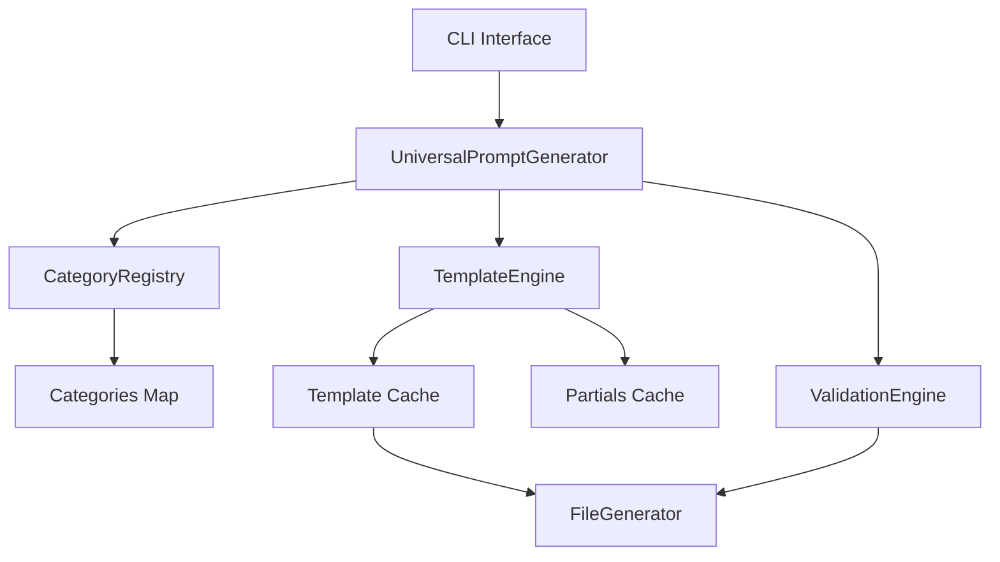
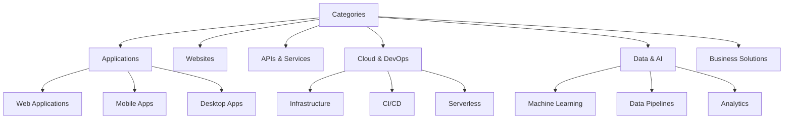
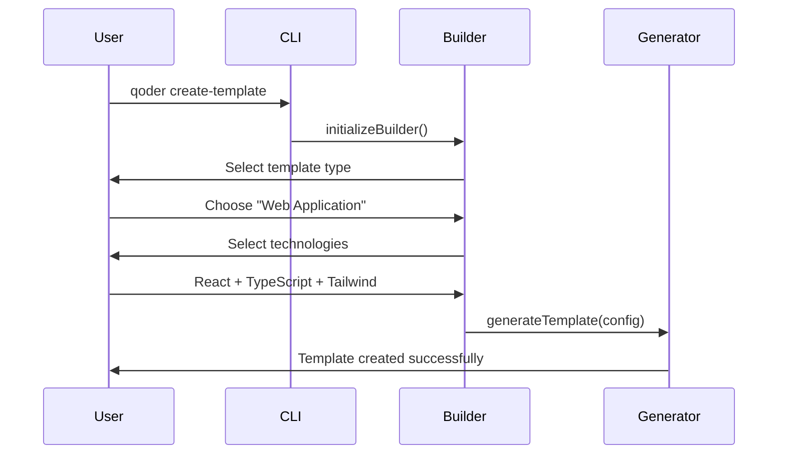
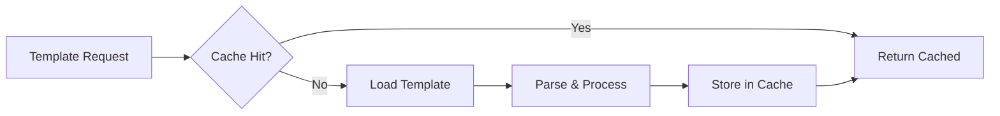

# Qoder AI System Expansion: Enhanced Prompt Templates & Categories

## Overview

This design outlines the expansion of the Qoder AI prompt generation system with new prompt templates, enhanced categories, improved functionality, and better user experience. The goal is to create a more comprehensive and versatile prompt factory that covers modern development scenarios and emerging technologies.

## Current System Analysis

### Existing Templates
- **Applications**: react-web-app.md, mobile-app.md, desktop-app.md
- **APIs**: express-api.md
- **Websites**: landing-page.md, readme-documentation.md
- **Games**: web-game.md

### System Architecture


## New Template Categories & Prompts

### 1. Cloud & DevOps Templates

#### Infrastructure as Code (iac-template.md)
- **Purpose**: Generate Infrastructure as Code templates for AWS, Azure, GCP
- **Tech Stack**: Terraform, CloudFormation, ARM, Pulumi
- **Features**: 
  - Multi-cloud support
  - Security best practices
  - Cost optimization
  - Monitoring setup

#### CI/CD Pipeline (cicd-pipeline.md)
- **Purpose**: Complete CI/CD workflow configurations
- **Tech Stack**: GitHub Actions, GitLab CI, Jenkins, Azure DevOps
- **Features**:
  - Automated testing
  - Security scanning
  - Multi-environment deployment
  - Rollback strategies

#### Microservices Architecture (microservices.md)
- **Purpose**: Design microservices-based applications
- **Tech Stack**: Docker, Kubernetes, Service Mesh
- **Features**:
  - Service discovery
  - API Gateway
  - Event-driven architecture
  - Observability

### 2. Modern Frontend Templates

#### Next.js Full-Stack App (nextjs-app.md)
- **Purpose**: Server-side rendered React applications
- **Tech Stack**: Next.js, TypeScript, Tailwind CSS
- **Features**:
  - SSR/SSG optimization
  - API routes
  - Authentication
  - SEO optimization

#### Vue.js Enterprise App (vue-enterprise.md)
- **Purpose**: Large-scale Vue.js applications
- **Tech Stack**: Vue 3, Composition API, Pinia, Vite
- **Features**:
  - Modular architecture
  - Type safety
  - Performance optimization
  - Testing strategy

#### Svelte/SvelteKit App (svelte-app.md)
- **Purpose**: Lightweight, fast web applications
- **Tech Stack**: Svelte, SvelteKit, TypeScript
- **Features**:
  - Minimal bundle size
  - Progressive enhancement
  - Server-side rendering
  - Form handling

### 3. Backend & Database Templates

#### GraphQL API (graphql-api.md)
- **Purpose**: Type-safe GraphQL APIs
- **Tech Stack**: Apollo Server, Prisma, TypeScript
- **Features**:
  - Schema-first design
  - Subscription support
  - Caching strategy
  - Security implementation

#### Serverless Functions (serverless-functions.md)
- **Purpose**: Cloud function implementations
- **Tech Stack**: AWS Lambda, Vercel Functions, Netlify Functions
- **Features**:
  - Event-driven architecture
  - Cold start optimization
  - Monitoring & logging
  - Cost optimization

#### Database Design (database-schema.md)
- **Purpose**: Comprehensive database designs
- **Tech Stack**: PostgreSQL, MongoDB, Redis
- **Features**:
  - Schema optimization
  - Indexing strategy
  - Migration scripts
  - Performance tuning

### 4. AI & Machine Learning Templates

#### LLM Integration App (llm-app.md)
- **Purpose**: Applications with LLM integration
- **Tech Stack**: OpenAI API, Anthropic, Local models
- **Features**:
  - Prompt engineering
  - Context management
  - Safety measures
  - Cost optimization

#### Data Pipeline (data-pipeline.md)
- **Purpose**: ETL/ELT data processing workflows
- **Tech Stack**: Apache Airflow, dbt, Python
- **Features**:
  - Data validation
  - Error handling
  - Monitoring
  - Scalability

### 5. E-commerce & Business Templates

#### E-commerce Platform (ecommerce-platform.md)
- **Purpose**: Complete online store solutions
- **Tech Stack**: Shopify, WooCommerce, Custom solutions
- **Features**:
  - Payment integration
  - Inventory management
  - Order processing
  - Analytics

#### SaaS Application (saas-app.md)
- **Purpose**: Multi-tenant SaaS platforms
- **Tech Stack**: Multi-framework support
- **Features**:
  - Tenant isolation
  - Billing integration
  - User management
  - API design

## Enhanced Category System

### New Category Structure


### Category Configuration Enhancement

#### Dynamic Technology Stack Detection
```javascript
const techStackMapping = {
  'frontend': {
    'react': ['react-web-app', 'nextjs-app'],
    'vue': ['vue-enterprise'],
    'svelte': ['svelte-app'],
    'angular': ['angular-app']
  },
  'backend': {
    'node': ['express-api', 'graphql-api'],
    'python': ['fastapi-service', 'django-app'],
    'go': ['gin-api', 'fiber-api']
  }
}
```

#### Feature-Based Template Selection
```javascript
const featureTemplates = {
  'authentication': ['auth-service.md'],
  'real-time': ['websocket-service.md'],
  'file-upload': ['file-storage.md'],
  'notifications': ['notification-service.md']
}
```

## Advanced Template Features

### 1. Template Composition System

#### Partial Templates for Reusability
```mustache
{{> auth/jwt-setup}}
{{> database/postgresql-setup}}
{{> api/error-handling}}
{{> deployment/docker-config}}
```

#### Conditional Template Sections
```mustache
{{#hasAuthentication}}
## Authentication Setup
{{> auth/implementation}}
{{/hasAuthentication}}

{{#hasDatabase}}
## Database Configuration
{{> database/{{databaseType}}-setup}}
{{/hasDatabase}}
```

### 2. Context-Aware Template Generation

#### User Preference Learning
- Track frequently used technology combinations
- Suggest optimal template combinations
- Personalized template recommendations

#### Project Context Analysis
- Detect existing project structure
- Suggest complementary templates
- Integration with existing codebase

### 3. Multi-Language Support

#### Template Internationalization
```javascript
const templateLocales = {
  'en': 'English templates',
  'es': 'Spanish templates', 
  'fr': 'French templates',
  'zh': 'Chinese templates'
}
```

## Enhanced CLI Features

### 1. Interactive Template Builder

#### Guided Template Creation


#### Template Customization Wizard
- Step-by-step template configuration
- Visual preview of generated structure
- Validation at each step
- Save custom configurations

### 2. Smart Template Suggestions

#### AI-Powered Recommendations
```javascript
const suggestionEngine = {
  analyzeProject: (projectPath) => {
    // Analyze existing code structure
    // Detect technologies and patterns
    // Return relevant template suggestions
  },
  
  suggestTemplates: (userInput, projectContext) => {
    // Use ML to suggest optimal templates
    // Consider user history and preferences
    // Return ranked template recommendations
  }
}
```

### 3. Template Validation & Testing

#### Automated Template Testing
```javascript
const templateValidator = {
  syntaxValidation: (template) => {
    // Validate Mustache syntax
    // Check for undefined variables
    // Verify partial references
  },
  
  contentValidation: (template) => {
    // Check for completeness
    // Validate code examples
    // Ensure best practices
  },
  
  integrationTesting: (template, context) => {
    // Test template rendering
    // Validate generated output
    // Check for conflicts
  }
}
```

## Performance Optimizations

### 1. Template Caching Strategy

#### Intelligent Cache Management


#### Cache Invalidation
- File system watching for template changes
- Version-based cache keys
- Memory-efficient storage

### 2. Parallel Template Processing

#### Concurrent Rendering
```javascript
const parallelRenderer = {
  renderTemplates: async (templates, context) => {
    const renderPromises = templates.map(template => 
      this.renderTemplate(template, context)
    );
    return await Promise.all(renderPromises);
  }
}
```

### 3. Lazy Loading for Large Template Sets

#### On-Demand Template Loading
- Load templates only when needed
- Progressive template discovery
- Reduced memory footprint

## Testing Strategy

### 1. Template Quality Assurance

#### Unit Testing Framework
```javascript
describe('Template Rendering', () => {
  test('should render React template correctly', async () => {
    const context = { projectName: 'TestApp', hasTypescript: true };
    const result = await templateEngine.render('react-web-app', context);
    expect(result).toContain('typescript');
    expect(result).toContain('TestApp');
  });
});
```

#### Integration Testing
- End-to-end template generation
- Multi-template combination testing
- Cross-platform compatibility

### 2. Performance Testing

#### Load Testing
- High-volume template generation
- Memory usage monitoring
- Response time benchmarking

#### Stress Testing
- Concurrent user simulation
- Resource exhaustion scenarios
- Error recovery testing

## Implementation Roadmap

### Phase 1: Core Template Expansion (Week 1-2)
- Implement 5 new high-priority templates
- Enhance CategoryRegistry with new categories
- Update CLI with new template options

### Phase 2: Advanced Features (Week 3-4)
- Implement template composition system
- Add context-aware generation
- Enhance validation engine

### Phase 3: Performance & UX (Week 5-6)
- Implement caching optimizations
- Add interactive template builder
- Implement smart suggestions

### Phase 4: Testing & Polish (Week 7-8)
- Comprehensive testing suite
- Documentation updates
- Performance optimizations

## Architecture Changes

### 1. Enhanced TemplateEngine

#### New Methods
```javascript
class TemplateEngine {
  // Composition support
  async renderWithPartials(templateId, context, partials = [])
  
  // Batch processing
  async renderBatch(templateIds, context)
  
  // Template validation
  async validateTemplate(templateId)
  
  // Dynamic template creation
  async createTemplate(config, content)
}
```

### 2. Extended CategoryRegistry

#### Advanced Category Management
```javascript
class CategoryRegistry {
  // Dynamic category loading
  async loadCategoryFromConfig(categoryConfig)
  
  // Category relationships
  getCategoryDependencies(categoryId)
  
  // Template mapping
  getTemplatesForCategory(categoryId, filters = {})
}
```

### 3. New TemplateBuilder Component

#### Interactive Template Creation
```javascript
class TemplateBuilder {
  constructor(templateEngine, categoryRegistry) {
    this.templateEngine = templateEngine;
    this.categoryRegistry = categoryRegistry;
  }
  
  async startInteractiveBuilder() {
    // Guided template creation process
  }
  
  async previewTemplate(config) {
    // Generate template preview
  }
  
  async saveCustomTemplate(template, metadata) {
    // Save user-created templates
  }
}
```